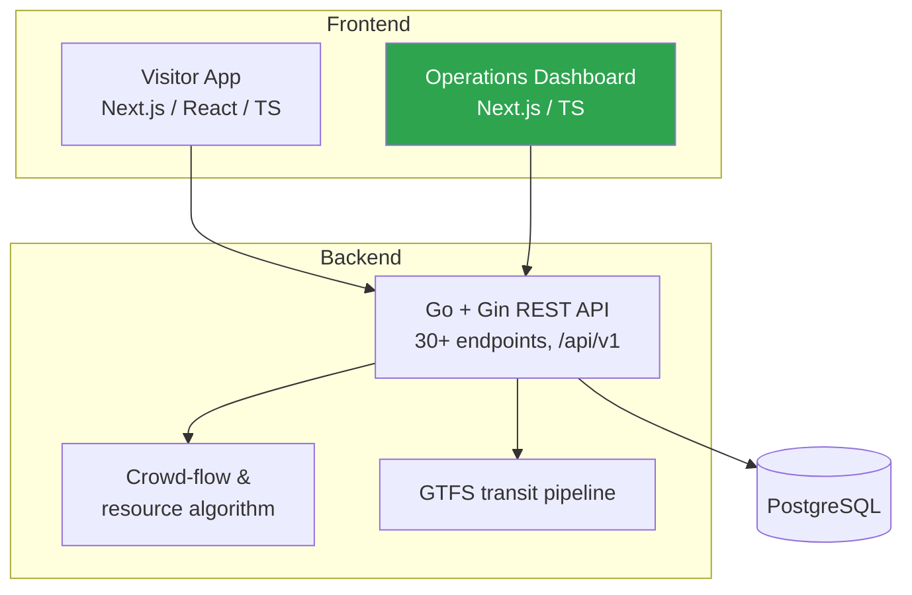

# Brisbane 2032 — Games Operations Platform

> A team-built information & operations platform for the Brisbane 2032 Olympic and Paralympic Games, featuring an **operations dashboard** and a **crowd-flow model** that predicts transport bottlenecks after events and recommends how to deploy resources.

## Overview

Built with a 7-person team as the capstone **IT Industry Project** for an Australian government-facing stakeholder, the platform has three parts:

- **Visitor App** — public-facing site (events, venues, athletes, medals, tickets, transport, accessibility).
- **Backend API** — a Go (Gin) + PostgreSQL REST API with 30+ versioned endpoints and a crowd-management algorithm.
- **Operations Dashboard** — an admin/operator panel for organisers to monitor crowd flow and manage resource deployment.

## My contribution

I focused on the **operations side**: the admin **dashboard** and the workflows organisers use to act on crowd predictions — real-time crowd-flow visualisation, a resource-deployment interface (create/update deployments by venue and type), and bottleneck warnings, all built on the backend crowd-flow and resource APIs.

## Architecture

*(Green = the component I owned.)* The whole stack runs via **Docker Compose** (PostgreSQL + Go API + Next.js apps).

## The crowd-management algorithm

After an event ends, the backend estimates the departing crowd and how it will stress nearby transport, then recommends resources. The pipeline:

1. **Estimate the leaving crowd** — model dispersal over time with a Normal cumulative distribution.
2. **Split across transport modes** — rail / bus / ferry / tram / other, redistributing shares when a mode has no stop in range.
3. **Assign people to nearby stops** — inverse-square (gravity) distance weighting.
4. **Detect bottlenecks** — compare demand vs hourly capacity per mode and grade severity (*warning → critical → emergency*).
5. **Recommend resources** — extra buses, multi-purpose vehicles, police and ambulance based on load and crowd density.

The algorithm is grounded in published sources (GTFS spec, the *Transit Capacity and Quality of Service Manual*, Wilson's spatial-interaction models, Fruin's pedestrian planning) and is covered by unit tests with zero database dependency.

## Highlights

- 30+ RESTful endpoints (`/api/v1/…`) with pagination, rate limiting and OpenAPI/Scalar docs
- GTFS pipeline for real Brisbane public-transport data
- Strong **accessibility** focus (WCAG toolbar: text scaling, high-contrast & colour-blind themes, reduced motion, ARIA) and EN/ZH internationalisation
- Docker-composed, dependency-injected, tested

## Skills demonstrated

Requirements & stakeholder work in a real client project · operations-dashboard design · working across a Go/PostgreSQL API and a Next.js/TypeScript frontend · turning an analytical model (crowd flow) into an operational decision tool · Agile team delivery.

---

*Team capstone project — Master of Data Analytics, QUT. This repository is a case-study write-up; it does not redistribute the team's full source or any client-provided material.*
